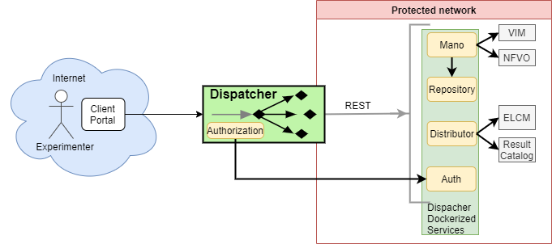
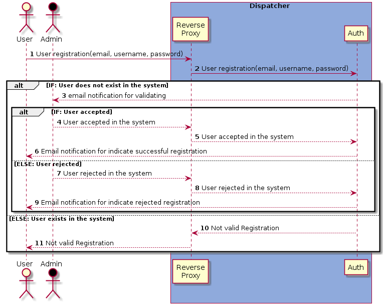
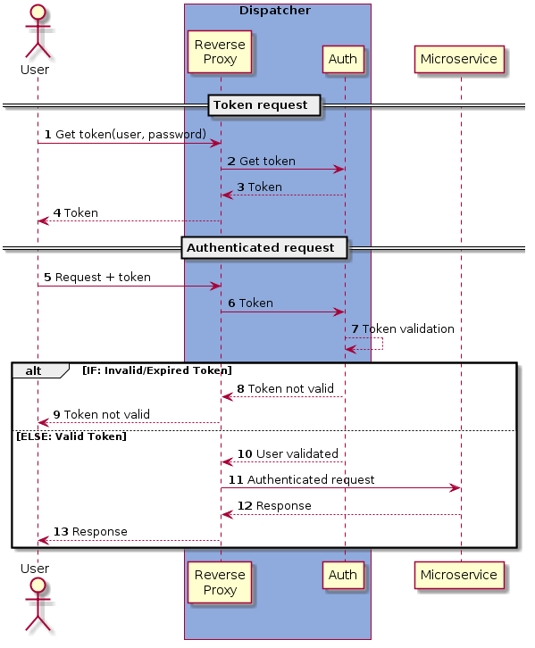
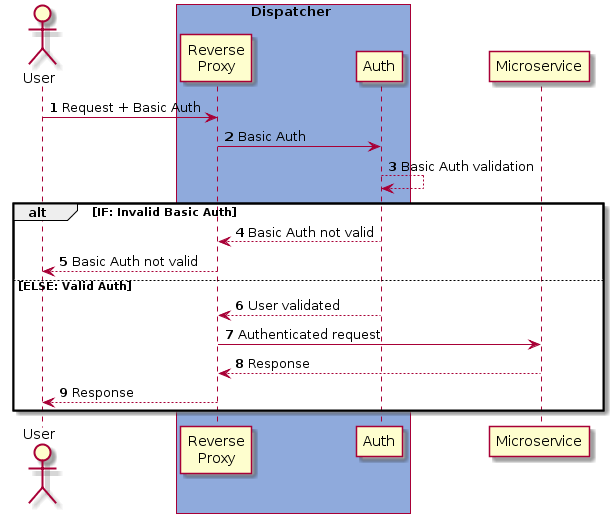
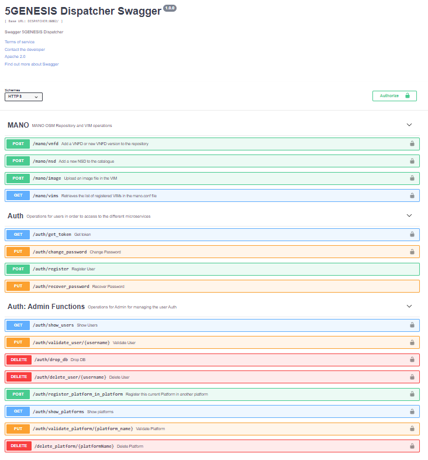

# 5GENESIS Dispatcher

The 5GENESIS Dispatcher is the entry point to the system, offering the functionalities to an Experimenter through a single interface. These functionalites are know as the Open APIs, being able to interact with the key features of the underlying modules (as shown in the architecture diagram below) without actually exposing them

This implementation is based on a NGINX reverse proxy containerised in a Docker environment.

By default, The *Dispatcher* includes as added on modules, the [Auth](auth/README.md "Validator"), the [MANO Wrapper](mano/README.md "MANO Wrapper") and a Swagger environment to test the available features.
On top of all that and to secure all the requests, the Dispatcher provides user registration and authentication using JWT. Consult the [Auth documentation](auth/README.md "Auth") for the available actions and how to use them.

**NOTE:** As shown below in the architecture diagram, the *Dispatcher* does not deal with the MANO directly but through a wrapper that simplies the communication. Also for simplification, in this document we will refer to the *MANO Wrapper* as ***mano***, which is conceptually correct from the *Dispatcher* point of view.

## Architecture

## Available features

The available features will depend on the features exposed by each dispatched module. The currently available features are:

##### MANO enabler
- Validation service: Validate VNFD or NSD as a standalone service
- Retrieve registered VIMs
- Upload VIM images
- List VNFDs
- Update VNFD with a new version
- List NSDs
- Update NSD with a new version

##### Repository
- Expose the directory of the NS and VNF artifacts.
- Integration with ETSI OSM
##### ELCM (Future Distributor)

- Validation of Experiment descriptor
- Retrieve stored experiments from the database
- Launch experiment (create)
- Cancel execution
- Get execution logs

## How the authentication works

It is important to know how the application works to make the most of it knowing why every step is taken.

Authentication is delegated to the *Auth* module. Users are registered into it and provide the ability to an user to claim an access token. This token is a JSON Web Token. It contains user's identity (subject id, name, email) and some meta data relatives to the authorization process (issuer, time to live, etc.). The access token can be claimed using Basic Authentication (username + password). The access token is online, that is, a token used by client apps having a direct user interaction (GUI such as: web site, desktop apps, mobile apps, etc). It's a short-lived token, so it shall be renew before its expiration date using a refresh token. Once claimed, the access token is renewed as well as the refresh token. And the process is repeated during the whole user session life time.
Instead of requesting an access token, it is also possible to authenticate every request using Basic Auth with a user already registered and validated by the Platform Administrator.

### The process is the following:

#### User registration
The user that wants to have access to the platform services will have to request the Platform Administrator for permission and the Administrator will grant it or deny it.

#### Platform registration
The Admin of one platform that wants to allow another platforms for using their services will have to request the Platform Administrator for permission and the Administrator will grant it or deny it.

#### Sending a request to a service
The *Dispatcher* allows two different authentication methods: Token authentication (JWT) and Basic authentication.

##### Request to a service using Token Authentication
Prior to any request to a service, the user needs to obtain an authentication token using valid credentials and Basic Auth. Once received the token, this is valid for the next 5 minutes and can be used to query any service behind the *Dispatcher*.

##### Request to a service using Basic Authentication
Basic authentication is also available: A registered user, using valid credentials should use them in every query to a service behind the *Dispatcher*. 

**NOTE:** To know more about the Auth module, go [here](auth/README.md "Auth docs") 

## Getting Started

These instructions will get you a copy of the project up and running on your local machine for development and testing purposes after you clone the [repository](https://gitlab.fokus.fraunhofer.de/5genesis/dispatcher.git).

### Pre-requisites

For running the 5Genesis Dispatcher, you will need:

+ docker version >= 18.09.6
+ docker-compose version >= 1.17.1
+ Configuration files correctly filled up:
    + [MANO Wrapper](mano/README.md#config-file "MANO Wrapper") module config: configuration file (`mano.conf`) inside the *mano* folder
+ NFVO + VIM

### Config file and installation

The Dispatcher needs to be configured properly before the containers are built. For that, a simplified configuration file is offered: `dispatcher.conf`, which will have to be edited and adapted.
The file should contain information of all the modules the Dispatcher forwards information to (validator, mano, elcm, result_catalog, etc.) and how to do it. For each module, a new enabler will be added in the Dispatcher. It uses the following format:

    [module_name]
    PROTOCOL=[http|https]
    HOST=x.x.x.x -> IP or DNS name of the host component
    PORT=xxxx -> Port where the app API is available
    PATH=/ -> Base path of the application ("/" by default)

    [mano]
    PROTOCOL=http
    HOST=mano
    PORT=5001
    PATH=/

The config file template already includes the *validator* and the *mano* modules as they are included within the *Dispatcher*. They are already configured and **should not be touched**.

During the installation process you will be asked for a couple of simple questions: One of them is whether you want the *Authentication module* installed as well or not, so it is completely optional.

Once edited properly, the configuration will be applied and the containers built, based on the config file we have just created (*dispatcher.conf*):

`$ ./install.sh`

#### Example

    [mano]
    PROTOCOL=http
    HOST=mano
    PROTOCOL=5001
    PATH=/
    

With the sample config file above, using the ELCM API as an **example**, the dispatcher will translate the original request to a new one. For example, the original URL would be the following one:
> Original URL: <http://192.168.33.102:5000/api/v0/run>

The previous URL is translated to a new one, removing the speficied base path (`/api`, in this example), adding a new base path common to all the requests directed to the ELCM (`/elcm` in this example) and leaving the particular endpoint (`/v0/run`) as it was:
> Translated URL: <http://{dispatcher_ip}:{dispatcher:port}/elcm/v0/run>

### Start

The start script will deploy and run the *Dispatcher* container, the [Validator](validator/README.md "Validator"), the [MANO Wrapper](mano/README.md "MANO Wrapper") and a Swagger environment to test the available features:

`$ ./start.sh`

Dispatcher will be accessible through port `8082` through a SSL certificate, so HTTPS is required.

Swagger environment will be accessible through port `5002`.
### Installation of the SSL certificate

The SSL certificate is self-signed. It is not supervised by a Certification Authority because in this current moment is not possible know where the platforms will be hosted.

For installing the certificate is required to open the internet navigator in: *https://<IP_OF_DISPATCHER>:8082*

Something like this will apear, the web page format depends of your browser:

You must add the exception/believe in the certificate or something like that. After this step, you are able to use the dispatcher through SSL certification.

### Stop

To stop the Dispatcher service just run the following:

`$ ./stop.sh`

## Try out the application

A swagger testing framework is deployed on port 5002 with the following API specifications:

## Repository
The repository is embedded in the Dispatcher component. The dispatcher, exports the filesystem created in the Mano component.
The repository allows the version control of VNFs and NSDs. In the main route (https://<IP<IP>>:8082/repository) we can found the following: 

There are 2 directories and one index. 'ns' directory is for hosting the network services and 'vnf' directory is for hosting the virtual network functions.
Also, we can found an index that will have the minimum information of each artifact:

We can observe 1 nsd_package and 2 vnf_package.
With the index metadata we can compose the path for looking every artifact. For instance, we can check one of them:

In the directory we can observe 2 files. The VNF package and the metadata.yaml that will have the detailed information of the file.
The metadata.yaml looks like:

The data composed with the VNFD specification and some parameters provided by the open APIs.

## Mano Indexing flow 
The mano microservice is in charge of validating all the artifacts for the NS onboarding (Images, VNFDs & NSDs). 
The following flow explains how this component analyze the current resources available and validate the new ingestion of each artifact.

## Logging

*Dispatcher* logs containing all access attemtps to the application are available in the `log` folder of the application.
In case of needing any help, contact the [authors](#authors) for support.

### Example

    192.168.33.11 - - [02/Jan/2020:15:31:05 +0000]  401 "POST /validator/validate/ed HTTP/1.1" 179 "-" "curl/7.59.0" "-"
    192.168.33.11 - - [02/Jan/2020:15:31:44 +0000]  200 "OPTIONS /auth/get_token HTTP/1.1" 0 "-" "Mozilla/5.0 (Windows NT 10.0; Win64; x64) AppleWebKit/537.36 (KHTML, like Gecko) Chrome/79.0.3945.88 Safari/537.36" "-"
    192.168.33.11 - - [02/Jan/2020:15:33:51 +0000]  204 "OPTIONS /mano/vnfd HTTP/1.1" 0 "-" "Mozilla/5.0 (Windows NT 10.0; Win64; x64) AppleWebKit/537.36 (KHTML, like Gecko) Chrome/79.0.3945.88 Safari/537.36" "-"
    192.168.33.11 - Javier [02/Jan/2020:16:00:24 +0000]  200 "GET /auth/get_token HTTP/1.1" 363 "-" "PostmanRuntime/7.21.0" "-"
    192.168.33.11 - - [02/Jan/2020:16:02:10 +0000]  200 "GET /mano/vnfd HTTP/1.1" 9407 "-" "PostmanRuntime/7.21.0" "-"
    192.168.33.11 - - [02/Jan/2020:16:08:22 +0000]  401 "GET /mano/nsd HTTP/1.1" 179 "-" "PostmanRuntime/7.21.0" "-"
    192.168.33.11 - Javier [02/Jan/2020:16:08:30 +0000]  200 "GET /auth/get_token HTTP/1.1" 363 "-" "PostmanRuntime/7.21.0" "-"
    192.168.33.11 - - [02/Jan/2020:16:08:48 +0000]  200 "GET /mano/nsd HTTP/1.1" 4916 "-" "PostmanRuntime/7.21.0" "-"

## Versioning

- 2.6.3 - Support for OpenNebula VIM to upload images
- 2.6.2 - New validation based on Image dependency for VNFs
- 2.6.1 - NSDs and VNFs More metadata added
- 2.6.0 - NSDs and VNFs Repository added with updated validation filter
- 2.5.1 - Swagger updated with new requests, and HTTPS
- 2.5.0 - SSL added (Self-sign certification )
- 2.4.1 - Auth Registration of Platforms With Token Service
- 2.4.0 - Auth Registration of Platforms
- 2.3.2 - Fix *Auth* typos
- 2.3.1 - Improve *Auth* response messages
- 2.3.0 - Update *validator* component to store the experiments
- 2.2.0 - Update *MANO* component to provide list of registered VIMs
- 2.1.0 - Make Authentication optional during the installation process
- 2.0.1 - Auth module documentation updated
- 2.0.0 - User registration and authentication
- 1.3.3 - Added VNFD and NSD update to the MANO API features and image uploading.
- 1.2.3 - Move to *fastjsonschema* for draft 7 schema validation.
- 1.2.0 - *MANO wrapper* is included now inside the *Dispatcher* as a new container.
- 1.1.0 - Added logging in the *Dispatcher* and the *Validator*.
- 1.0.0 - First stable version including all features.

## Next steps

- Introduce the Distributor microservice that will be in charge of validate experiments, distribute them, and obtain the results through the result catalog.

## Authors

Javier Melian (javier.melian@atos.net)

Luis Gómez (luis.gomez.external@atos.net)

## License

Licensed under the Apache License, Version 2.0 (the "License");
you may not use this file except in compliance with the License.
You may obtain a copy of the License at

   > <http://www.apache.org/licenses/LICENSE-2.0>

Unless required by applicable law or agreed to in writing, software
distributed under the License is distributed on an "AS IS" BASIS,
WITHOUT WARRANTIES OR CONDITIONS OF ANY KIND, either express or implied.
See the License for the specific language governing permissions and
limitations under the License.
