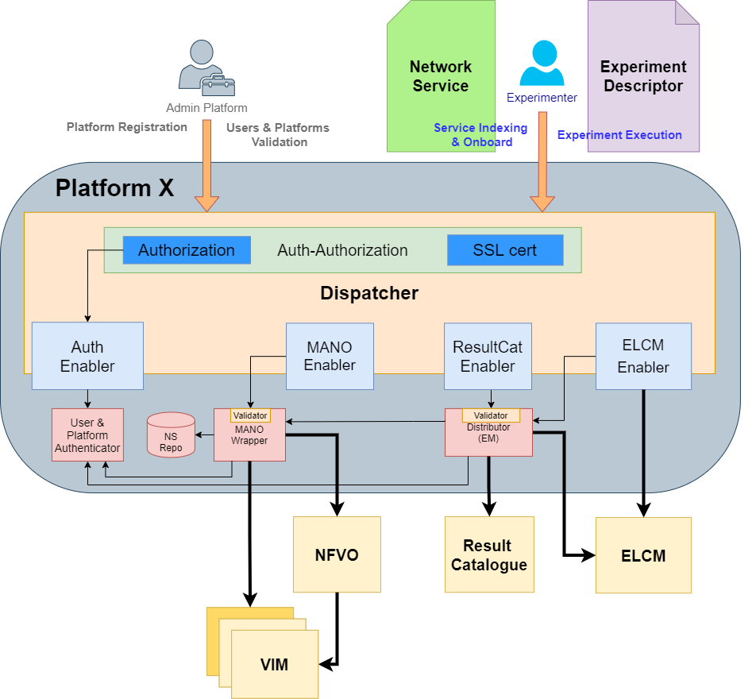

# 5GENESIS Dispatcher

## Architecture

## Getting Started

These instructions will get you a copy of the project up and running on your local machine for development and testing purposes.

### Pre-requisites

For running the 5Genesis Dispatcher, you will need:
- docker version >= 18.09.6
- docker-compose version >= 1.17.1

### Config file
The Dispatcher needs to be configured properly before it is deployed. For that a simplified configuration file is offered: `dispatcher.conf`, which will have to be edited and adapted.
The file contains information of all the modules the Dispatcher forwards information to and how to do it. It uses the following format:

    [module_name]
    protocol=[http|https]
    ip=x.x.x.x
    port=xxxx
    path=/

Once edited properly, the configuration should be applied:
> $ ./dispatcher.sh

#### Example
    [elcm]
    protocol=http
    ip=192.168.33.102
    port=4000
    path=/
    [validator]
    protocol=http
    ip=192.168.33.105
    port=5100
    path=/
    [mano]
    protocol=http
    ip=192.168.33.105
    port=5001
    path=/

### Installation

### Start

### Stop

## Available features

## Try out the application

## Next steps

## Authors
Javier Melian (javier.melian@atos.net)

## License

Licensed under the Apache License, Version 2.0 (the "License");
you may not use this file except in compliance with the License.
You may obtain a copy of the License at

   > http://www.apache.org/licenses/LICENSE-2.0

Unless required by applicable law or agreed to in writing, software
distributed under the License is distributed on an "AS IS" BASIS,
WITHOUT WARRANTIES OR CONDITIONS OF ANY KIND, either express or implied.
See the License for the specific language governing permissions and
limitations under the License.

