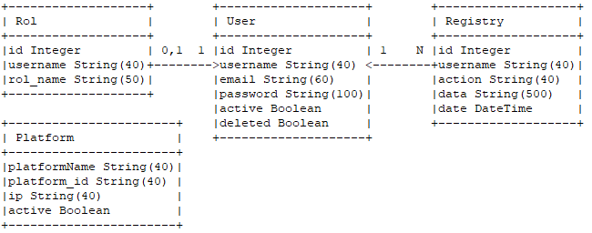

# Auth

Auth is an API-REST in charge of manage the Authorization. Build under Python3.6 using Flak library and sqlite database.

## Features
Auth have the following  features for each rol:
- Users
  - User Registration
  - User LogIn
  - User Get  Token
  - User Change Password
  - User Recover password
- Admin
  - Register Platform in another platform
  - Show Users
  - Delete one User
  - Validate one User
  - Show Platforms
  - Validate Platform
  - Delete Platform
  - Drop Data Base

## Technologies
Pythhon 3.6 with dependencies:
```
jwcrypto
gevent
Flask
Flask-SQLAlchemy==2.1
requests
flask_mail
flask-cors
flask-restful
``` 
## File Structure
``` 
auth/                                   Main Folder
|
├─ swagger/                             Swagger Folder
|   └──swagger.json                     Swagger Specification
|
├─ templates/                           Folder for different templates
│   ├─ recover.html                     Recover password template
│   ├─ validate_platform.html           Validate platform template
|   └──validate_user.html               Validate users template
│ 
├─ auth.db                              SQL Database
├─ Auth.py                              Server
├─ auth_logic.py                        Service logic
├─ auth_utils.py                        Utils tools
├─ constants.py                         Constans file
├─ DB_Model.py                          Database Model
├─ DockerFile                           DockerFile for building the conatiner
├─ key.json                             Key for encrypt/desencrypt Tokens
├─ MailConfig.py                        Mail config
├─ requirements.txt                     Python  Dependencies
└─ settings.py                          Server settings
``` 

### Database Model
DB is defined in DB_Model.py and has the following structure:

Once the DB is created, the Admin user is created, with username "Admin", password "Admin" and email "5genesismanagement@gmail.com", setted in the mail config.

There are 3 tables.
- For Role table we can found 3 attributes:
  - id   >>      Primary key
  - username >>  Foreign key to User table
  - rol_name >>  Rol in the system 
 - User table with 6 attributes:
   - id    >>     Primary key
   - username  >> Unique key to User
   - email  >> Unique in the system 
   - password >> Password for the user
   - active >> Account validated, true for validated, false for not.
   - deleted >> Account deleted by the users. But it persist for view the traces
  - Registry table with 5 attributes:
    - id    >>     Primary key
    - username  >> Foreign key to User table
    - action >> function requested by the User
    - data >> parameters for the request given
    - date >> timestamp with the exact time where the action was requested
### Email Config
Email config is defined in MailConfig.py

### Settings
Settings for the auth: 
- Loading the 'key.json' for encrypting and decrypting tokens.
- Setting the token timeout

## Install & Run
Auth is very easy to install and deploy in a Docker container.

By default, the Docker will expose port 2000, so change this within the Dockerfile if necessary. When ready, simply use the Dockerfile to build the image.

```sh
cd auth
docker build -t auth .
```
This will create the auth image and pull in the necessary dependencies.

Once done, run the Docker.


For run the image and map the port to whatever you wish on your host. 

```sh
sudo docker run -p 2000:2000 auth
```
The service will be exposed in port 2000.
## Sequence Diagrams

### User Registration


### Password change


### Get Token


### LogIn


### Change Password


### Recover Password


### Show registered users in the system


### Drop users database


### Detele a single user from the database


### Activate a single user from the database


### Delete account


## Authors

Luis Gómez (luis.gomez.external@atos.net)

## License

Licensed under the Apache License, Version 2.0 (the "License");
you may not use this file except in compliance with the License.
You may obtain a copy of the License at

   > <http://www.apache.org/licenses/LICENSE-2.0>

Unless required by applicable law or agreed to in writing, software
distributed under the License is distributed on an "AS IS" BASIS,
WITHOUT WARRANTIES OR CONDITIONS OF ANY KIND, either express or implied.
See the License for the specific language governing permissions and
limitations under the License.
