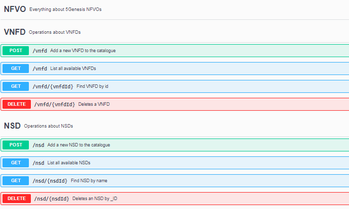

# 5GENESIS MANO Wrapper

Standalone REST API part of 5Genesis' OSS for interactions with in the MANO.
This application uses the NFVO and VIM original API, bypassing security and abstracting the type of NVFO or VIM used to the user, that should not be aware of sensitive information but must use the functionalities of the underlying application.

**Supported NFVOs**

OSM

**Supported VIMs**

Openstack

The original documentation for the OSM API can be found [here](https://osm.etsi.org/wikipub/index.php/NBI_API_Description).

[OSM VNFD information model](http://osm-download.etsi.org/ftp/osm-doc/vnfd.html)

[OSM NSD information model](http://osm-download.etsi.org/ftp/osm-doc/nsd.html)

## Getting Started

These instructions will get you a copy of the project up and running on your local machine for development and testing purposes.

### Pre-requisites

For running the 5Genesis MANO wrapper you will need:

- docker version >= 18.09.6
- docker-compose version >= 1.17.1
- NFVO + VIM

### Config file

Modify the file `mano.conf` to adapt it to your testbed needs, with **one** NFVO and from none to several VIMs:

    [NFVO]
    TYPE=<type of NFVO. Currently only 'OSM' is supported>
    IP=<IP address of your NFVO>
    USER=<user name with admin rights within the NFVO>
    PASSWORD=<Password to the previous user>

    [VIM]
    [[vim-1-name]]
        NAME=<name of the VIM 1, only for later identification>
        TYPE=<type of VIM. Currently only 'openstack' is supported>
        LOCATION=<Location of the VIM: [core|edge]>
        AUTH_URL=<VIM 1 auth URL>
        USER=<VIM username>
        PASSWORD=<VIM username password>
        PROJECT=<VIM project>
    [[vim-2-name]]
        NAME=<name of the VIM 2>
        TYPE=<type of VIM. Currently only 'openstack' is supported>
        LOCATION=<Location of the VIM: [core|edge]>
        AUTH_URL=<VIM 2 auth URL>
        USER=<VIM 2 username>
        PASSWORD=<VIM 2 username password>
        PROJECT=<VIM 2 project>
    ...

#### Example

    [NFVO]
    TYPE=OSM
    IP=192.168.33.100
    USER=adminosm
    PASSWORD=*****
    
    [VIM]
    [[malaga-core]]
        NAME=malaga-core
        TYPE=openstack
        LOCATION=core
        AUTH_URL=http://192.168.33.11:5000/v3
        USER=admin
        PASSWORD=***********
        PROJECT=admin

### Installation
**NOTE:** It is not necessary to install and start the application if the installation has been done through the *Dispatcher*.

`$ ./install.sh`

### Start

To start MANO wrapper, run:

`$ ./start.sh`

This will start your application on port 5101 along with a Swagger environment to test the API running on port 5002

### Stop

To stop MANO wrapper, run:

`$ ./stop.sh`

## Available features

## Try out the application

You can find [here](https://osm-download.etsi.org/ftp/osm-6.0-six/7th-hackfest/packages/) examples of VNFD and NSD packages to populate and test the application

## NBI REST API

### VNFD 

| **Method**  | **URI** | **Description** | **Data** | **Params** | **Successful result** | **Error result** |
| ------- | --- | ------------| ---- | --------- | -------- | ------------ |
| POST  | /vnfd | Add a new VNFD to the catalogue | [VNFD Package](https://osm-download.etsi.org/ftp/osm-6.0-six/7th-hackfest/packages/) | - | [id](schemas/osm_id.json) | [error](schemas/osm_error.json) |
| GET  | /vnfd | List all available VNFDs | - | - | [VNFD](schemas/osm_vnfd_schema.json) | [error](schemas/osm_error.json) |
| GET  | /vnfd/{vnfd id} | Find VNFD by id | - | VNFD id | [VNFD](schemas/osm_vnfd_schema.json) | [error](schemas/osm_error.json) |
| DELETE  | /vnfd/{vnfd _id} | Deletes a VNFD | - | VNFD _id | - | [error](schemas/osm_error.json) |
| PUT  | /vnfd/{vnfd _id} | Updates a VNFD providing the new VNFD package and the _ID of the old one that is being updated | [VNFD Package](https://osm-download.etsi.org/ftp/osm-6.0-six/7th-hackfest/packages/) | - NSD _id | [id](schemas/id_im.json) | [error](schemas/osm_error.json) |

### NSD 

| **Method**  | **URI** | **Description** | **Data** | **Params** | **Successful result** | **Error result** |
| ------- | --- | ------------| ---- | --------- | -------- | ------------ |
| POST  | /nsd | Add a new NSD to the catalogue | [NSD Package](https://osm-download.etsi.org/ftp/osm-6.0-six/7th-hackfest/packages/) | - | [id](schemas/osm_id.json) | [error](schemas/osm_error.json) |
| GET  | /nsd | List all available NSDs | - | - | [NSD](schemas/osm_nsd_schema.json) | [error](schemas/osm_error.json) |
| GET  | /nsd/{nsd id} | Find NSD by id | - | NSD id | [NSD](schemas/osm_nsd_schema.json) | [error](schemas/osm_error.json) |
| DELETE  | /nsd/{nsd _id} | Deletes a NSD | - | NSD _id | - | [error](schemas/osm_error.json) |
| PUT  | /nsd/{nsd _id} | Updates a NSD providing the new NSD package and the _ID of the old one that is being updated | [NSD Package](https://osm-download.etsi.org/ftp/osm-6.0-six/7th-hackfest/packages/) | - NSD _id | [id](schemas/id_im.json) | [error](schemas/osm_error.json) |

### VIM related operations 

| **Method**  | **URI** | **Description** | **Data** | **Params** | **Successful result** | **Error result** |
| ------- | --- | ------------| ---- | --------- | -------- | ------------ |
| GET  | /vims | Retrieves the list of registered VIMs in the mano.conf file | - | - | [VIMs list](schemas/vim_list.json) | - |
| POST  | /image/{vim name} | Uploads an image in the VIM | image | vim_name, disk_format, container_format | "Image status: active" | - |

#### Examples on how to use it

You can test the API using your favorite REST client following these simple workflow:

- Insert a VNFD package:

    `curl -X POST -F "vnfd=@./<vnfd_package_file>" http://<host>:5101/vnfd`

    Response:

    >{"id": "VNFD_id_assigned_by_the_NFVO"}

- Insert a NSD package:

    `curl -X POST -F "nsd=@./<nsd_package_file>" http://<host>:5101/nsd`

    Response:

    >{"id": "NSD_id_assigned_by_the_NFVO"}

- List all available VNFDs:

    `curl -X GET "http://<host>:5101/vnfd" -H "accept: application/json"`

    Response:

    >List of available VNFDs in JSON format. (according to the NFVO information model) 
    
    >Format of the response: [{...}]
    
- Retrieve an individual VNFD descriptor:

    `curl -X GET "http://<host>:5101/vnfd/<VNFD id>" -H "accept: application/json"`

    Response:

    >VNF descriptor in JSON format. (according to the NFVO information model)
    
    >Format of the response: [{...}]

- List all available NSDs:

    `curl -X GET "http://<host>:5101/nsd" -H "accept: application/json"`

    Result:

    >List of available NSDs in JSON format. (according to the NFVO information model)
    
    >Format of the response: [{...}]

- Retrieve an individual NSD descriptor:

    `curl -X GET "http://<host>:5101/NSd/<NSD id>" -H "accept: application/json"`

    Result:

    >NS descriptor in JSON format. (according to the NFVO information model)
    
    >Format of the response: [{...}]

- Delete an individual NSD:

    `curl -X DELETE "http://<host>:5101/nsd/<NSD _id>" -H "accept: application/json"`

- Delete an individual VNFD:

    `curl -X DELETE "http://<host>:5101/vnfd/<VNFD _id>" -H "accept: application/json"`

- Upload an image file in a specific VIM:

    `curl -X POST -F "image=@./<image_file>" http://<host>:5101/image/<vim_name>?disk_format=<raw|qcow2>&container_format=bare`

    Result:

    >Image status: active
    
    >Format of the response: String

## Logs

Application logs are available in the application directory as `mano.log`

#### Example

    2019-11-13 17:26:42,678 -MANO API- INFO Validating VNFD hackfest_cloudinit_vnf.tar.gz
    2019-11-13 17:27:12,145 -MANO API- INFO Validating NSD file
    2019-11-13 17:27:12,155 -MANO API- INFO Unpacking file for validation
    2019-11-13 17:27:12,224 -MANO API- INFO Deleting temporary files
    2019-11-13 17:29:21,939 -MANO API- INFO Retrieving available VNFDs

## Versioning

- 1.1.0: Include support for multiple VIMs
- 1.0.0: First full stable version

## Next steps

+ Add OpenNebula as supported VIM

## Authors

Javier Melian (javier.melian@atos.net)

## License

Licensed under the Apache License, Version 2.0 (the "License");
you may not use this file except in compliance with the License.
You may obtain a copy of the License at

   > <http://www.apache.org/licenses/LICENSE-2.0>

Unless required by applicable law or agreed to in writing, software
distributed under the License is distributed on an "AS IS" BASIS,
WITHOUT WARRANTIES OR CONDITIONS OF ANY KIND, either express or implied.
See the License for the specific language governing permissions and
limitations under the License.
