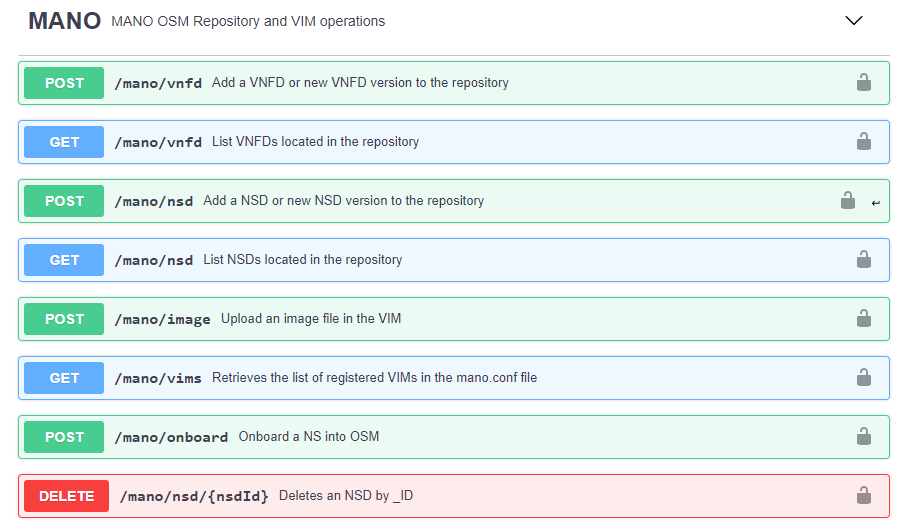
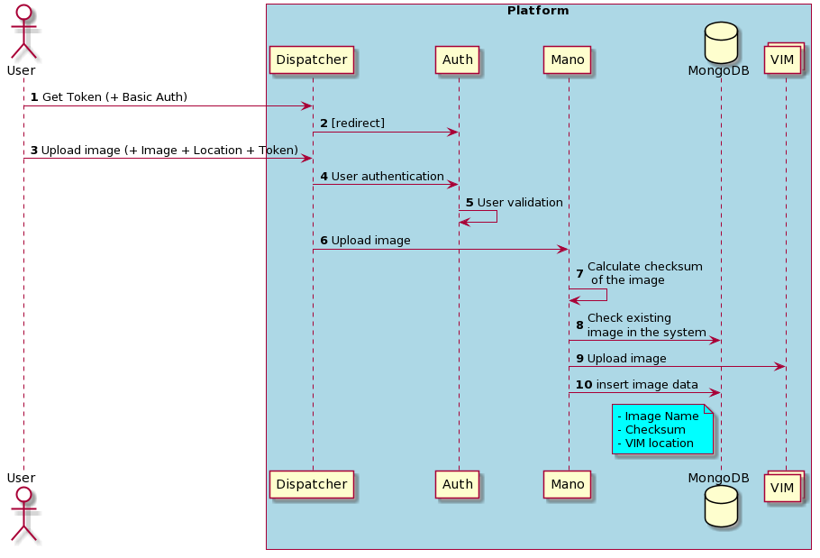
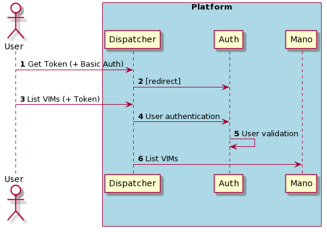
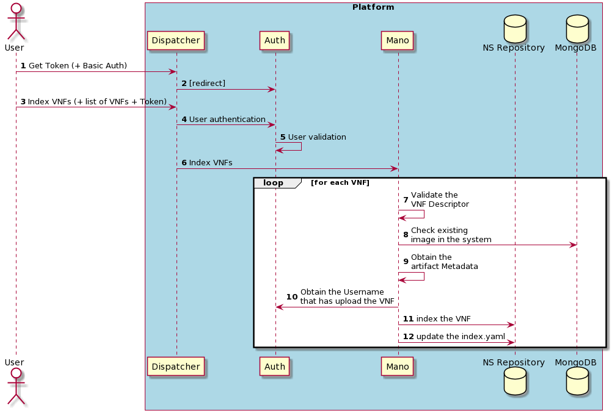
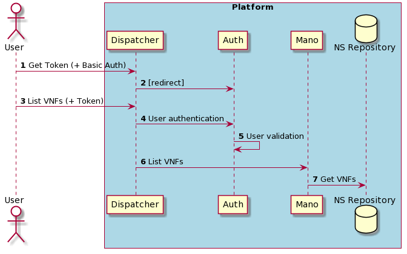
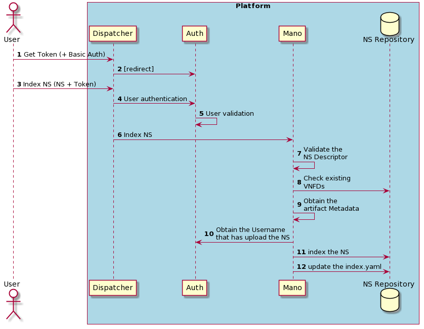
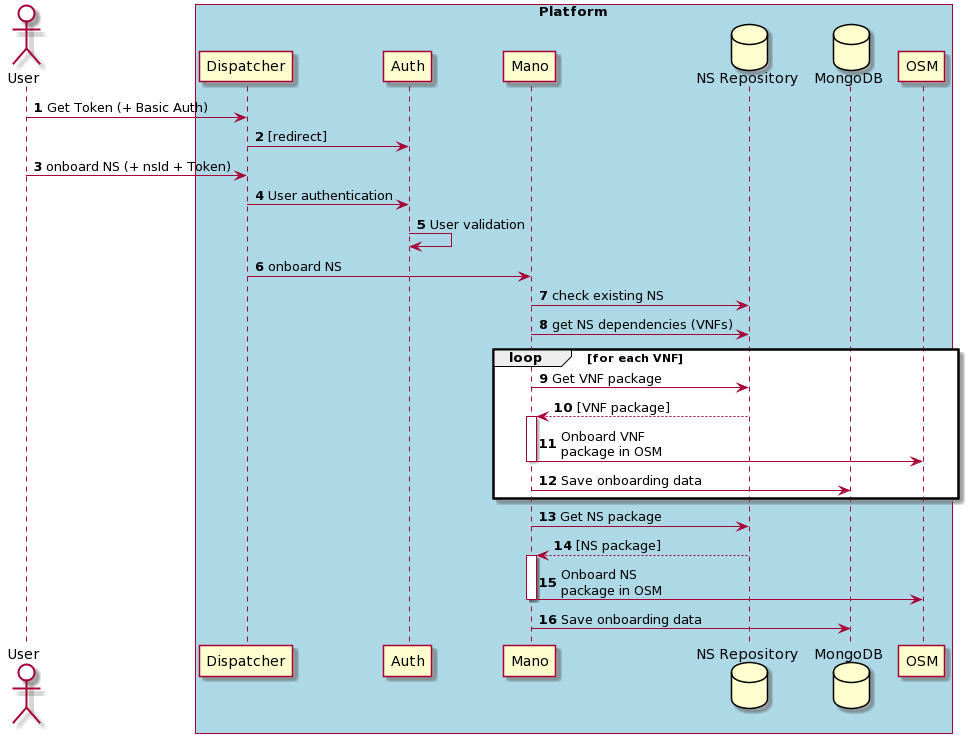
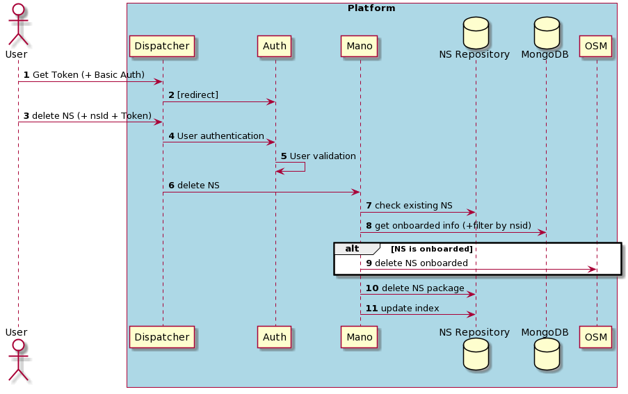

# 5GENESIS MANO Wrapper

Standalone REST API part of 5Genesis' OSS for interactions with in the MANO.
This application uses the NFVO and VIM original API, bypassing security and abstracting the type of NVFO or VIM used to the user, that should not be aware of sensitive information but must use the functionalities of the underlying application.

**Supported NFVOs**

- OSM

     The original documentation for the OSM API can be found [here](https://osm.etsi.org/wikipub/index.php/NBI_API_Description).

     [OSM VNFD information model](http://osm-download.etsi.org/ftp/osm-doc/vnfd.html)

     [OSM NSD information model](http://osm-download.etsi.org/ftp/osm-doc/nsd.html)

**Supported VIMs**

- Openstack

- Opennebula

## Features
- Indexing Network Services Repository(OSM 8 Compliant)
    * VNF
    * NS
- Validation of Network Services Descriptors
- Dependencies Check for:
    * VNF: Images required must be uploaded in the VIM
    * NS: VNFs required must be indexed in the repository 
- List all the VNFs and NSs available in the repository
- Onboard in OSM the required artifacts of a Network Service
- Upload images to OpenStack and OpenNebula
- List all the VIMs available
- List all the images available
- Delete a Network Service
    * Delete from the index
    * Delete from OSM
 
## Technologies
Python 3.x with dependencies:
```
requests==2.20.1
Flask==1.0.2
gevent==1.4.0
pymongo==3.8.0
Flask-RESTful==0.3.7
PyYAML==5.1
Flask-Cors==3.0.8
openstacksdk==0.38.0
configobj==5.0.6
jsonschema==2.6.0
packaging==20.3
pyone==5.10.4
paramiko==2.6.0
scp==0.13.2

``` 
## File Structure
``` 
mano/                                   Main Folder
|
├─ libs/                                Folder for host libraries
│   ├── osm_nbi_util.py                 OSM library
|   └── openstack_util.py               OpenStack library
|
├─ schemas/                             Folder with json schemas for validating
│   ├── nsd_schema.json                 Json schema for validate NSD
|   └── vnfd_schema.json                Json schema for validate VNFD
│ 
├─ mano.conf                            Configuration file to be fill up
├─ mano.py                              Mano Server
├─ utils.py                             Util functions
├─ validator.py                         Validation functions
├─ requirements.py                      Python requirements
└─ swagger.json                         Swagger API specification
``` 
## Settings
Modify the file `mano.conf` to adapt it to your testbed needs, with **one** NFVO and from none to several VIMs:

    [NFVO]
    TYPE=<type of NFVO. Currently only 'OSM' is supported>
    IP=<IP address of your NFVO>
    USER=<user name with admin rights within the NFVO>
    PASSWORD=<Password to the previous user>

    [VIM]
    [[vim-1-name]]
      TYPE=<Type of VIM: [openstack|opennebula]>
      LOCATION=<Location of the VIM: [core|edge]>
      AUTH_URL=<VIM 1 auth URL>
      USER=<VIM username>
      PASSWORD=<VIM username password>
      PROJECT=<VIM project>
    [[vim-2-name]]
      TYPE=<Type of VIM: [openstack|opennebula]>
      LOCATION=<Location of the VIM: [core|edge]>
      AUTH_URL=<VIM 2 auth URL>
      USER=<VIM 2 username>
      PASSWORD=<VIM 2 username password>
      #Note: if the VIM type is opennebula, the following fields are required
      IP=<IP of the images server>
      SERVER_USER=<SSH user with write permissions in the images folder>
      SERVER_PASS=<Password matching the SSH user>
      FOLDER=<Folder where the images must be uploaded ending with "/">

#### Example

    [NFVO]
    TYPE=OSM
    IP=192.168.33.100
    USER=adminosm
    PASSWORD=*****
    
    [VIM]
    [[malaga-core]]
        TYPE=openstack
        LOCATION=core
        AUTH_URL=http://192.168.33.11:5000/v3
        USER=admin
        PASSWORD=***********
        PROJECT=admin
## Pre-requisites

For running the 5Genesis MANO wrapper you will need:

- docker version >= 18.09.6
- docker-compose version >= 1.17.1
- MongoDB
- NFVO + VIM

## Install & Run
Mano Wrapper is very easy to install and deploy in a Docker container.
By default, the Docker will expose port 5001, so change this within the Dockerfile if necessary. 
When ready, simply use the Dockerfile to build the image.

```sh
cd mano
docker build -t mano .
```
This will create the mano image and pull in the necessary dependencies.

Once done, run the Docker.


For run the image and map the port to whatever you wish on your host. 

```sh
sudo docker run -p 5001:5001 mano
```
The service will be exposed in port 2000.
## Rest interfaces
The API interfaces are described in the swagger service exposed in 5002 port.


## Flow for NS indexing process
The following flow describes all the process to ingest a NS, taking account the artifacts dependencies for each component o a Network Service.


## Sequence Diagrams
The following sequence diagram describes the flow of each request showed above.
### Upload image

<!-- https://www.planttext.com/?text=TL9DJyCm3BtdLrZTXMdQ7-20rcqIciGG1uOcCGvkwhNHqgGqBen_ZvDLZF6HG-J4xpq_Eva5nexxnYhisRk-AQXJ2ZNx3ZQ1EXXPKzNyNXicfGf_XEp18kzzrsH3hh0zAP2LjbRaZ3OjEePiQKABh6lgCi00o-rlIDvpdPBvzc-HDJgVBajaB30GhBsh_78UIKqCKrPxQqcpyIx0qsfzrZfjv4eGzqgfrDNqHinSmoqnFFe3ERYQm1o3qH3zZDLo6o6vG9uxAaqdoYyNp4rhFPPW6gmeabSfcC2TrnXDI9Y4n-gRLXAGETVafBs4K_bbzWsjAK-PWHZxlwodujKvjK2hUtaJ0XcqFeI-sJdmUv0oF_1fMaA8CA2Z2MnS1JjtwiAuH0aVWQdvuiWi_wa-g1adldcOH7mZvRnuiRJdw2AXO8IlFQhfCAPxR4WEYy6kX585x32wz5PHGyKravDypqy0 -->

### List VIMs

<!-- https://www.planttext.com/?text=RP31IWGn44Jl_HNDU74HVy23xCY022vuK1aG3psPrZHcaY7fg9zlal6mY_QXBrNrA6gVbABcnG5b3Jul4qS0CXeYFYMEUERatUgN5MM0ANnZz-18tq9SkbzjSfa1oxMt5fmOMSahTeEabTHOZXrImc7yQ-cpsYRsu_-G0_a0cyH-nb8105gro-j2lC9RLdmC7-pn_09lA8d12jt1C5PBNomlaMU9RFJr97alIV7vxf1giY5sS9HgrZABPL_Qa4hmq9-gd-HatfGjLziUWQ7UllGk2_y0 -->

### Index VNFs

<!-- https://www.planttext.com/?text=RLB9JiCm4BtxAqRX0ghW0tf0j4GW3WN4KbMY72R9jBP8xCYUGFltZ9tku8CLvosUD-ERmEYvQsg57JlRDGLvfR1av-4za8UpsYmr_sZ3f5JXLf0zryWBvvjiWnLrHmfafQqLErEQ5Yr3bflG8fUQV0OO89_zfOmwrWaSpVutcQ1rUwH2nW83GVRu2Y_Kkc2ar7Loy78y8KsSNRfydE0cVk-T-eri1P9AAPNINbvBaKEu9uOtzqKMpWSmnc1AY7LUg7mMAIEXV7YgZAUIFu-K3xQY5KmVxqAKrYOmk4L_7lIM5-h09Kcbyvgi14OspghHCVgDjQbwP2EC7JcyITNEjI0Z0S9InrygKlRKQMz18FVChU2GKoYzQQLrEsfgpn1kDPLVG2kftDWbpArfS4bWR1H3M0UcviJ-gM3Su7CR9xUGzmCJOeo3s95ZeWDg36UnYHhMoA1bH5rREwmI75F8sehZR8TIHSoyXO-nhjr6x6bNQvHNBVDLQTt8bpppNm00 -->

### List VNF

<!-- https://www.planttext.com/?text=RL5DIyH03BtdLuHwSP7z0nvaAqKlxY9-KH0FQHjji9qfCwaV_zxCLDXTD8T0ybuUxyriebBGUHo0PlLk7XiE0DIg3_WOEU3986-zVlQY3D3uBonk1z9N7yRY5sk6cG6jSfjCJbgPo2aMbSI9jEqv54WHg_elfPorps1P_o-o9UVtI4TA3KN6OdUFTppvA6RrEoi46_VCfR7hq5m3G4wplZ0JvtZDYW_-dHsUdk4bHMan-LX1LITAQPJdm9q4RlNbwF96ekBJxYgcooonWeEhJBMNxDbP05Bn3ifZz8C6wHPakKi13uGXpMcVuYnMyzfgOsdigtu0 -->

### Index NS

<!-- https://www.planttext.com/?text=RLBBJiCm4BpxArRXqWh11_I0MeX075eGZweIvR19jhNLn8xi3RH_ppefJLkmP4lsp8vdrXu7HizDLIfisDccoiWhXJax3--1F5oKPgtvMnicfJAtXUIvH5uvNoLxB2iRKY2ZNMgHCxcfqJ8agGarSgx99u01qiLVogHXtOAJnVyYKxIkHmfap30G9BDNUA7Q1IDMTws2bstFx1Qo1OXhfLIRvkf6J8pWWHZUt8Oi32xX5eF98VeOgdGHAHEXV7WgZAUSFqyg7sr1Mv2x1p8lEv6XEgfhoT9BJLOY81jdrUGK_SBI51soBumPUssbuhu_dtTy0X5TMhatfP1xKqlm0pDc7y6Tfdm3j3M1ZLt3qivdzsauatlA68sDOaA8ZLx9SyEK66Dp3-HezuWQdLkiOWrhPD3IyAOk7HOj75shCpUcpRD7Jw6c_WtKiQvtA5-m6sDvC_cGFm00 -->

### List NS

<!-- https://www.planttext.com/?text=RL5DIyH03BtdLuHwSH7_W0VPIi6BBekhK10FQPkrOTkPCfFwyU_DJCLrqHm2oNjvl3UpZaf1vt40cjMxUMmu052hFk1Jv81dWxps-jwBCa3ZFx3O3gHx7yRY6sk6cG6jSfjCJbgPo2aMbSI9jEqv54WHg_elfPorps1P_ozoJyuVaOwK6egCnMQ73ppvA6RrCoi46u_CfR7hq5m3G4vpUMqchl2M5H_zWHsUN-0DHMan-LX1LITAQPJdm9q4RlNbvF9Eek9c5zDXLbZ1hwFCj8VisPb_Kl4EobFqZGRf5cIvI_b-T25DQPkoB3vjQRMs8FPBNm00 -->

### Onboard NS

<!-- https://www.planttext.com/?text=hLDDJy904BtFhvZK2uJm1pWO84JZ0J2YXWGvJBTZkw7iDhjRn7_lR07boyI3UshdpPjzxqtRzu5SgDSbK1sigTSfEm1ImJfyyUpmfjHv4JuA7HWWjLjC7aiAxzQjapsMbZK3ogbaabQw8XCm6MbVKL05kmJ9usX-sJAeGz60WqjmJCOsnOm2fUGPayaCdxYoNekspuRdvFMiQMnDRaV31bx7vul9qzaOs6GeNW2WyTYz5NqzlEU0ptR51biT79BN2gF4DepciMKWBGl7cNQimlA4QKrgoMKe4eLg_4E6dTseDXon6uhaNB0HEHIqDJ0uHJTKwco7x8anYUCR81OY4DttK19MA-Ijza6R_1BFnPJ8ohWIqsoKPe-jrycTRqDfROMoIMHI1KhjZ1hpaAgafrQKCyGgThybBOwmPVnaz8O2xpPt62HXzt2wrnxxtyoUWTeqgyZuEhDPNWzdjE63-UWlRXhY_k2AMF7vczOVw4zIfVr_bCRJ5xdoXtq1 -->

### Delete NS

<!-- https://www.planttext.com/?text=PL91Ri8m4Bpx5QlqKeJw0GuLGKXL3xHLQIMageTDl2GMZXtPcnP-txL19O1FjcTcFJFoF3867ZghS63lXgwYe1JMx0DyHWfmPqtJyczhc9Ig_1wADukyzQ4hJbXb1r8WgvT9fZOzEePYQMAFNBSK2i08oyqjfHoupM1v2wxG-NofaR72I52yhE6TUX-DU3jaNP3Z5MdbNUENYmntQNyp-NMzKkGqI1QbSiI7Hx4tWoTY-F0xSd0_XGL6KqDoE57BJQAKGlaAf4sWchylb9eiCO4O5AMBpngcnqaJDH9dXRJSaXCpoCOxLLwYFsYDFY8dOUfXz81AvtIVeiz0wgrtG7iJsRXcZEViCsWaatULnw19Wt5RBnQtnh8yLXt4gz7Y4IqdyoQUkV-3fAvnm3D1EbHNTiwq7kiTDdI53xs48x6XIRhFQovZvFVz0G00 -->


## Logs

Application logs are available in the application directory as `mano.log`

#### Example

    2019-11-13 17:26:42,678 -MANO API- INFO Validating VNFD hackfest_cloudinit_vnf.tar.gz
    2019-11-13 17:27:12,145 -MANO API- INFO Validating NSD file
    2019-11-13 17:27:12,155 -MANO API- INFO Unpacking file for validation
    2019-11-13 17:27:12,224 -MANO API- INFO Deleting temporary files
    2019-11-13 17:29:21,939 -MANO API- INFO Retrieving available VNFDs

## Versioning
- 2.0.0: Network Service Repository
- 1.1.0: Include support for multiple VIMs
- 1.0.0: First full stable version

## VIM & NFVO RESOURCES

### VNFD 

| **Method**  | **URI** | **Description** | **Data** | **Params** | **Successful result** | **Error result** |
| ------- | --- | ------------| ---- | --------- | -------- | ------------ |
| POST  | /vnfd | Add a new VNFD to the catalogue | [VNFD Package](https://osm-download.etsi.org/ftp/osm-6.0-six/7th-hackfest/packages/) | - | [id](schemas/osm_id.json) | [error](schemas/osm_error.json) |
| GET  | /vnfd | List all available VNFDs | - | - | [VNFD](schemas/osm_vnfd_schema.json) | [error](schemas/osm_error.json) |
| GET  | /vnfd/{vnfd id} | Find VNFD by id | - | VNFD id | [VNFD](schemas/osm_vnfd_schema.json) | [error](schemas/osm_error.json) |
| DELETE  | /vnfd/{vnfd _id} | Deletes a VNFD | - | VNFD _id | - | [error](schemas/osm_error.json) |
| PUT  | /vnfd/{vnfd _id} | Updates a VNFD providing the new VNFD package and the _ID of the old one that is being updated | [VNFD Package](https://osm-download.etsi.org/ftp/osm-6.0-six/7th-hackfest/packages/) | - NSD _id | [id](schemas/id_im.json) | [error](schemas/osm_error.json) |

### NSD 

| **Method**  | **URI** | **Description** | **Data** | **Params** | **Successful result** | **Error result** |
| ------- | --- | ------------| ---- | --------- | -------- | ------------ |
| POST  | /nsd | Add a new NSD to the catalogue | [NSD Package](https://osm-download.etsi.org/ftp/osm-6.0-six/7th-hackfest/packages/) | - | [id](schemas/osm_id.json) | [error](schemas/osm_error.json) |
| GET  | /nsd | List all available NSDs | - | - | [NSD](schemas/osm_nsd_schema.json) | [error](schemas/osm_error.json) |
| GET  | /nsd/{nsd id} | Find NSD by id | - | NSD id | [NSD](schemas/osm_nsd_schema.json) | [error](schemas/osm_error.json) |
| DELETE  | /nsd/{nsd _id} | Deletes a NSD | - | NSD _id | - | [error](schemas/osm_error.json) |
| PUT  | /nsd/{nsd _id} | Updates a NSD providing the new NSD package and the _ID of the old one that is being updated | [NSD Package](https://osm-download.etsi.org/ftp/osm-6.0-six/7th-hackfest/packages/) | - NSD _id | [id](schemas/id_im.json) | [error](schemas/osm_error.json) |

### VIM related operations 

| **Method**  | **URI** | **Description** | **Data** | **Params** | **Successful result** | **Error result** |
| ------- | --- | ------------| ---- | --------- | -------- | ------------ |
| GET  | /vims | Retrieves the list of registered VIMs in the mano.conf file | - | - | [VIMs list](schemas/vim_list.json) | - |
| POST  | /image/{vim name} | Uploads an image in the VIM | image | vim_name, disk_format, container_format | "Image status: active" | - |


## Authors

- Javier Melian (javier.melian@atos.net)
- Luis Gómez (luis.gomez.external@atos.net)

## License

Licensed under the Apache License, Version 2.0 (the "License");
you may not use this file except in compliance with the License.
You may obtain a copy of the License at

   > <http://www.apache.org/licenses/LICENSE-2.0>

Unless required by applicable law or agreed to in writing, software
distributed under the License is distributed on an "AS IS" BASIS,
WITHOUT WARRANTIES OR CONDITIONS OF ANY KIND, either express or implied.
See the License for the specific language governing permissions and
limitations under the License.
