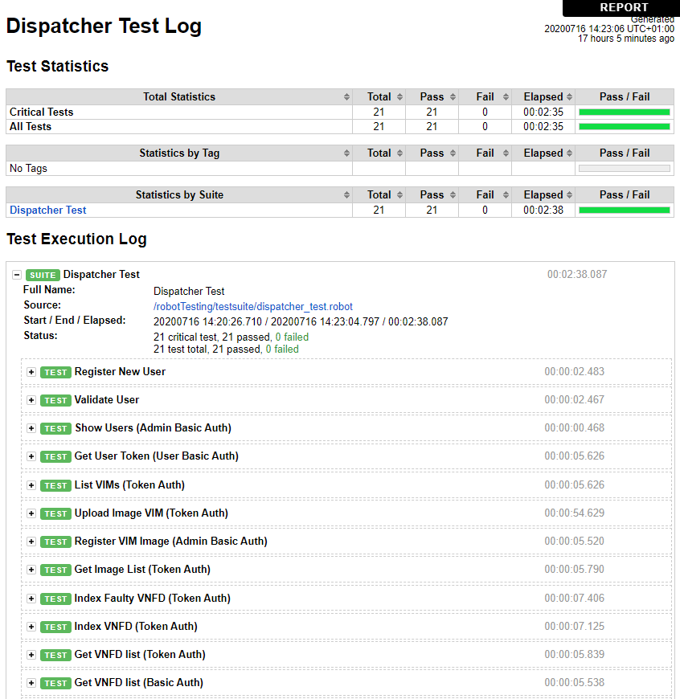

# Robot testing
Robot framework testing

## Introduction
We have created a set of tests to audit the behaviour of the Dispatcher. These tests can be run by the developer, after the release of a new version to verify the previously implemented functions are still working and nothing is broken after the new commit; or by the user, to verify the Dispatcher is correctly installed, configured and connected with its neighbour elements.
The tests are written using Robot Framework [https://robotframework.org], a generic open source automation framework which can be used for test automation and robotic process automation (RPA). Robot Framework is open and extensible and can be integrated with virtually any other tool to create powerful and flexible automation solutions. Being open source also means that Robot Framework is free to use without licensing costs.
The testing framework is executed in a separate container which also includes a web server that serves the testing reports after the execution of the set of tests is finalised. 
 

## Tests description

Each endpoint is tested following the logical cycle of the application, just like a human user would do it manually:

###  1.  Register new user
This test defines a (fake) new user (and password) and registers it in the platform.

### 2. Validate user
To avoid human intervention in the tests, we bypass the Platform Operator and validate the user “manually” with administrator credentials without the need of accepting the registration request via email.

### 3. Show users
Shows a list of the users registered in the platform. This function can only be executed by an admin user.

### 4. Get user token
With the user created in a previous step, we obtain the authentication token, which is kept to be used to authenticate the user in later requests.

### 5. List VIMs
Tests the list of registered VIMs in the Platform.

### 6. Upload image VIM
As regular VM images are quite heavy, this test does not use a valid image to check this feature, but it rather generates a fake image of 5MB and it is uploaded to an specific VIM, avoiding having to wait several minutes (or hours) for a simple test execution.

### 7. Register VIM Image (Basic Auth)
The internal cross-check of the repository requires that all the images used in a VNFD are registered in the Dispatcher before the VNFD is indexed. Often it is faster to upload the images directly to the VIM and skip the uploading through the Dispatcher application but then the image would not be properly registered. This process allows the manual registration of an image that is already present in a VIM (needs admin credentials).

### 8. Get image list
This test shows a list of the registered images and verifies the images created in the previous two tests are present.

### 9. Index Faulty VNFD (Token Auth)
This test tries to index a VNFD that will not pass the syntax validation on purpose, returning the error that caused it.

### 10. Index VNFD (Token Auth)
Indexes a valid test VNFD that uses the fake image registered previously.

### 11. Get VNFD list (Token Auth)
Obtains the list of registered VNFDs in the repository and verifies the one indexed in the previous step is in the list.

### 12. Get VNFD list (Basic Auth)
Same test as the above one but using basic authentication instead of token based.

### 13. Index Faulty NSD (Token Auth)
This test tries to index an NSD that will not pass the syntax validation on purpose, returning the error that caused it.
### 14. Index NSD (Token Auth)
Indexes a valid test NSD that uses the test VNFD indexed previously.

### 15. Get NSD list (Token Auth)	
Obtains the list of registered NSDs in the repository and verifies the one indexed in the previous step is in the list.

### 16. Validate Bad Experiment Descriptor
This test tries to validate a badly formed experiment descriptor, so it will not pass the syntax validation on purpose, returning the error that caused it.

### 17. Validate Experiment Descriptor
Validates a test experiment descriptor and should return a successful response.

### 18. Onboard NSD (Token Auth)
Onboards the previously indexed NSD onto the NFVO and returns an id.

### 19. Delete NSD
Deletes the previously onboarded NSD from the NFVO, the repository and removes its dependencies that are not in use by any other NSD.

### 20. Delete user
Deletes the test user created at the beginning of the testing.

### 21. Drop DB
Deletes the database that keeps all the user information and restores it to the initial state.

## Configuration

The testing environment needs to be configured before starting the container.
The `environment.rc`, in the `config` folder, file needs to be edited to adapt it to the local environment:

    # Test variables

    TEST_EMAIL=<user e-mail address>
    API_URL=<Dispatcher API URL. Example: https://192.168.33.116:8082>
    VIM_NAME=<VIM name. Example: malagacore>

> Alternatively, these environment variables can be modified on runtime by editing the file above and running the `reload_env.sh` script to reload the values.

## Execution

The previous set of tests can be executed by running a script:

    $ ./runtests.sh

This test starts the web server to show the reports after the testing and executes all the tests.
The report is accessible via web browser on port 8200.

