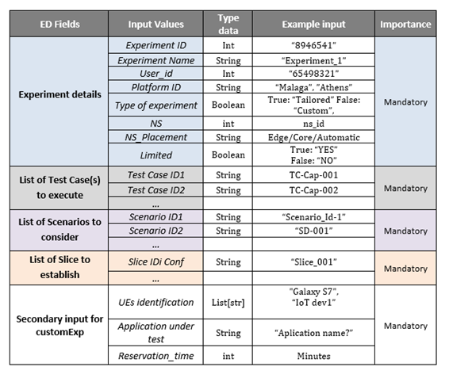

# 5GENESIS Validator

This module validates the correct syntax of the Experiment descriptor and the descriptors of the Network Service (VNFD + NSD). It allows two options: a stand alone validation service that returns whether the descriptor is correct or not and the onboarding option, which, besides the validation, performs the onboard of the descriptor after a successful validation or the launch of the experiment in case the descriptor belongs to an experiment. Also, as part of this last scenario, the experiment descriptor is stored in the *validator* database for later reusage or consultation.

**Note**: the Experiment descriptor validation is based on the latest version of the Experiment descriptor information model defined below. Therefore, older versions are not supported.

## Experiment descriptor definition

All fields are required except the *Reservation_time* one, that is only required if the experiment is attended.

## Experiment descriptor example

    {
        "Id": 123,
        "Name":"sfafd",
        "User": 123,
        "Platform": "malaga",
        "TestCases": ["TC1", "TC2"], 
        "UEs": ["UE1", "UE2"], 
        "Slice": "slice id", 
        "NS": "ns_id",
        "NS_Placement": "Edge",
        "Limited": true,
        "Type_experiment": false,
        "Scenario": ["scenario1", "scemarop2"], 
        "Application": ["app1"],
        "Attended": true, 
        "Reservation_time": 123 
    }    

## Network service descriptors

The 5GENESIS Validator also validates VNFD and NSD packages.
For now only OSM descriptors are supported:

[VNFD information model](http://osm-download.etsi.org/ftp/osm-doc/vnfd.html "VNFD IM")

[NSD information model](http://osm-download.etsi.org/ftp/osm-doc/nsd.html "NSD IM")

## Validator configuration

As part of the *Validator* features, it performs not only validation but also onboards VNFDs and NDSs and launches Experiments defined by its Experiment Descriptor. To carry ouf these actions, the *validator* needs to know the destination URLs of those external services: this information is gathered in the file `config.env`.

### config.env example:

    ELCM_ED_POST="http:///localhost:8082/elcm/v0/run"
    MANO_NSD_POST=http://mano:5101/nsd
    MANO_VNFD_POST=http://mano:5101/vnfd

**NOTE**: MANO_NSD_POST and MANO_VNFD_POST are known URLs, as the *MANO Wrapper* is installed along with the *Validator* and therefore, should not be changed (unless the *Validator* is installed stand-alone).

## NBI REST API

The Validator is available through the Dispatcher port (8082) and using the endpoint `/validator` or, if deployed stand-alone, in port `5100`:

### Validator 

| **Method**  | **URI** | **Description** | **Data** | **Successful result** | **Error result** |
| ------- | --- | ------------| ---- | --------- | ------------ |
| POST  | /validate/ed | Validate Experiment descriptor | [ED](experiment_schema.json) | [response message](schemas/response_detail.json) | [response message](schemas/response_detail.json) |
| POST  | /create/ed | Validate, launch Experiment descriptor and store it| [ED](experiment_schema.json) | ? | [response message](schemas/response_detail.json) |
| GET  | /ed | List of Experiment descriptors | [ED](experiment_schema.json) | ? | [response message](schemas/response_detail.json) |
| GET  | /ed/<exp_id> | Get a single experiment descriptor | [ED](experiment_schema.json) | ? | [response message](schemas/response_detail.json) |
| POST  | /validate/vnfd | Validate VNFD | [VNFD Package](https://osm-download.etsi.org/ftp/osm-6.0-six/7th-hackfest/packages/) | [response message](schemas/response_detail.json) | [response message](schemas/response_detail.json) |
| POST  | /onboard/vnfd | Validate VNFD and add it to the NSD catalogue | [VNFD Package](https://osm-download.etsi.org/ftp/osm-6.0-six/7th-hackfest/packages/) | [id](schemas/osm_id.json) | "Error message" |
| POST  | /validate/nsd | Validate NSD | [NSD Package](https://osm-download.etsi.org/ftp/osm-6.0-six/7th-hackfest/packages/) | [response message](schemas/response_detail.json) | [response message](schemas/response_detail.json) |
| POST  | /onboard/nsd | Validate NSD and add it to the NSD catalogue | [NSD Package](https://osm-download.etsi.org/ftp/osm-6.0-six/7th-hackfest/packages/) | [id](schemas/osm_id.json) | [response message](schemas/response_detail.json) |

### Examples
Depending on how the application was installed (in stand-alone mode or along with the *Dispatcher*), the host, port and base path might change:

- [x] Validator relative path: {validator_host}:5100

- [x]  Dispatcher relative path: {dispatcher_host}:8082/validator

- Validate Experiment descriptor:
`/validate/ed`

Example:
> curl -X POST -d @descriptor.json <http://{relative path}/validate/ed>

- Validate and onboard Experiment descriptor:
`/onboard/ed`

Example:
> curl -X POST -d @descriptor.json <http://{relative path}/onboard/ed>

- Validate VNF descriptor:
`/validate/vnfd`

Example:
> curl -X POST -F "vnfd=@./vnf_descriptor.tar.gz" <http://{relative path}/validate/vnfd>

- Validate and onboard VNF descriptor:
`/onboard/vnfd`

Example:
> curl -X POST -F "vnfd=@./vnf_descriptor.tar.gz" <http://{relative path}/onboard/vnfd>

- Validate NS descriptor:
`/validate/nsd`

Example:
> curl -X POST -F "nsd=@./ns_descriptor.tar.gz" <http://{relative path}/validate/nsd>

- Validate and onboard NS descriptor:

`/onboard/nsd`

Example:
> curl -X POST -F "nsd=@./ns_descriptor.tar.gz" <http://{relative path}/onboard/nsd>

## Responses

The *Validator* issues a [response message](schemas/response_detail.json) in json format along with a status code:

- 200, 201: ok
- 400: Error during the validation
- 409: Conflict with descriptor already present
- 412: Wrong file in the request
- 500: Network error

## Logging

Application logs are available in the application directory as `validator.log`

#### Example

    2019-12-09 12:17:38,704 -VALIDATOR API- INFO Starting app
    2019-12-09 12:23:51,381 -VALIDATOR API- INFO Validating Experiment descriptor
    2019-12-09 12:23:51,400 -VALIDATOR API- DEBUG Experiment descriptor:
    2019-12-09 12:23:51,506 -VALIDATOR API- DEBUG Experiment descriptor sucessfully validated
    2019-12-09 12:24:07,708 -VALIDATOR API- INFO Validating Experiment descriptor
    2019-12-09 12:24:07,721 -VALIDATOR API- DEBUG Experiment descriptor:
    2019-12-09 12:24:07,803 -VALIDATOR API- DEBUG Problem while validating Experiment descriptor: '1234' is not of type 'integer'

## Next steps

- TBD

## Authors

Javier Melian (javier.melian@atos.net)

## License

Licensed under the Apache License, Version 2.0 (the "License");
you may not use this file except in compliance with the License.
You may obtain a copy of the License at

   > <http://www.apache.org/licenses/LICENSE-2.0>

Unless required by applicable law or agreed to in writing, software
distributed under the License is distributed on an "AS IS" BASIS,
WITHOUT WARRANTIES OR CONDITIONS OF ANY KIND, either express or implied.
See the License for the specific language governing permissions and
limitations under the License.

